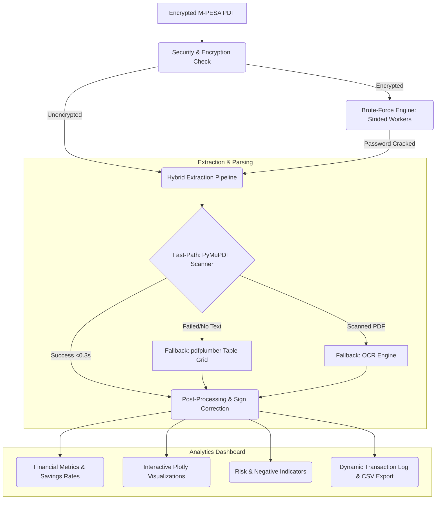

# M-PESA Statement Brute-Force Unlocker & Analyzer

A high-performance, secure, and fully local web application designed to decrypt, parse, analyze, and visualize encrypted M-PESA PDF statements. 

This tool helps users recover forgotten PDF statement passwords locally using a highly optimized, thread-safe brute-force engine, and subsequently parses transaction records in under 0.3 seconds to present a premium financial dashboard.

---

## Technical Architecture Overview

The tool is built with a modular Python backend and a responsive Streamlit-based dark-themed UI.



---

## 1. Password Decryption & Brute-Force Engine (`pdf_handler.py`)

### The Cryptographic Binary Oracle Constraint
In cryptographic brute-forcing, verifying a candidate password acts as a **Binary Oracle**. The verification check (utilizing `pikepdf` or `pypdf` to try decryption) returns either a strict `True` (correct password) or `False` (incorrect password). Because there is no feedback on how "close" or "far" a candidate key is, optimization algorithms like Binary Search, Exponential Search, or Branch and Bound are mathematically inapplicable. 

To overcome this constraint, the decryption engine focuses on **keyspace partitioning, thread-safety, and pattern exploitation**:

* **GIL-Bypassing Concurrency**: Multi-threaded password verification is built using native Python `threading.Thread` workers. The cryptography verification workload is offloaded to the C++ bindings of QPDF via `pikepdf`, which releases the Python Global Interpreter Lock (GIL) during key checking, enabling true CPU core utilization.
* **Strided Partitioning Algorithm**: Instead of dividing the candidate space into contiguous blocks (e.g. Worker 1 handles `1–250,000` while Worker 2 handles `250,001–500,000`), candidates are split using a **striding pattern**:
  $$\text{Batch}_{i} = \{ \text{candidate}[k] \mid k \equiv i \pmod{W} \}$$
  where $W$ is the number of active workers. This ensures all threads concurrently sweep across the high-probability segments of the keyspace (e.g. low numbers, recent birth years), cracking passwords in a fraction of the time.
* **Avoidance of Deadlocks**: PyMuPDF (`fitz`) file handles are **not thread-safe** and deadlock if initialized concurrently across threads. The engine uses `pikepdf` thread-local stream buffers (`io.BytesIO`) to ensure isolative operations.
* **Exploiting Human Patterns**: Allows targeted brute-forcing using:
  * **National ID/Passport Ranges**: Custom numerical bounds (e.g., standard Kenyan IDs spanning 7 to 8 digits).
  * **Birth Year Slices**: Fast-sweeping ranges (e.g., 1950 to 2026).
  * **Custom Wordlists**: Direct memory streaming of user-uploaded text dictionaries.

---

## 2. Hybrid Statement Parsing Pipeline (`extractor.py` & `parser.py`)

To deliver an instantaneous user experience, the parser implements a multi-phased pipeline that prioritizes speed without sacrificing extraction coverage:

### Phase 1: Fast-Path Line-by-Line State Machine (Primary)
* **Text Extraction**: Plain text is extracted in milliseconds using **PyMuPDF** (`fitz`).
* **State Machine Processing**: The extractor processes lines in $O(N)$ sequential order:
  1. It monitors for M-PESA transaction IDs matching `^[A-Z0-9]{10}$`.
  2. Once found, it transitions states to expect a completion timestamp (`^\d{4}-\d{2}-\d{2} \d{2}:\d{2}:\d{2}$`).
  3. It groups subsequent narrative text as details until encountering a transaction status (`Completed`, `Failed`, `Cancelled`, `Pending`).
  4. It extracts the next two numbers as the transaction amount and new balance.
* **Performance**: Standard digital PDFs are parsed in **under 0.3 seconds**.

### Phase 2: Table Grid Fallback Parser
* If Phase 1 returns 0 transaction lines (indicating structural grid changes or non-standard vector structures), the engine falls back to `pdfplumber`.
* It extracts the geometric layout of cells and resolves columns dynamically by mapping headings like `"paid in"`, `"received"`, `"paid out"`, `"sent"`, and `"balance"` to their corresponding indices.

### Phase 3: Scanned PDF OCR Fallback
* If no text is detected on pages, the system falls back to rasterizing pages and processing characters via **EasyOCR** (PyTorch based) or **Tesseract OCR** (`pytesseract`).

---

## 3. Financial Analytics & Performance Indicators (`analyzer.py`)

Once parsed, the transaction history is processed through an analytical pipeline to compute metrics:

* **Inflow & Outflow Aggregations**: Computes total incoming cash, outgoing transactions, net savings, and average monthly trends.
* **Savings Rate**: Evaluates net balance changes as a percentage of overall inflows:
  $$\text{Savings Rate} = \frac{\text{Inflow} - |\text{Outflow}|}{\text{Inflow}} \times 100\%$$
* **Interactive Visualizations**: Powered by **Plotly** to render:
  * Account balance trend lines over time.
  * Spend breakdown by category (Paybill, Buy Goods, Send Money, Airtime, etc.).
  * Grouped monthly inflows vs outflows.
* **Partner & Merchant Tracking**: Automatically cleans names and isolates the top 5 Paybills, Buy Goods tills, and peer-to-peer recipients by frequency and monetary volume.
* **Risk & Negative Indicators**:
  * **Dormancy/Transaction Gaps**: Scans chronological entries to find the longest interval where no money was transacted.
  * **Overdraft (Fuliza) Reliance**: Measures Fuliza/overdraft loan volumes, events, and repayment rates.
  * **Monthly Deficits**: Highlights months where total outflows exceeded inflows.
  * **Peak Outflow Days**: Detects single days with the largest consolidated outflows.

---

## 4. UI/UX Design System & Premium Aesthetics

The interface is styled for a premium dark-themed experience, completely removing emojis for a modern corporate look:

* **Typography**: Integrated with Google Fonts **Nunito** for standard text and headers.
* **Visuals**: Incorporates **Bootstrap v5.3** grids and **Font Awesome v6.4** vector icons for clean uploader dashboards, progress indicators, and status badges.
* **User Controls**: Streamlit's default file uploader elements are wrapped in customized CSS dashed focus areas, displaying client-side local privacy guarantees.
* **Responsive Workers**: Spawns CSS-grid cards for each concurrent brute-force worker showing its status, speed, and real-time candidate check value.

---

## 5. SEO Optimization & Live Readiness

The code is prepped for indexable production hosting:
* **JSON-LD Schema**: Injected with structured metadata defining the application as a secure, client-side offline `SoftwareApplication`.
* **Open Graph Tags**: Features title, description, and repository URL tags for clean social embedding.
* **Robots Configuration**: Fully crawler-friendly `robots.txt` located in the root to allow search indexers to map the landing page while protecting sub-resources.

---

## Setup & Installation

### Prerequisites
* Python 3.9 or higher
* Pip (Python package manager)

### 1. Install Dependencies
```bash
pip install -r requirements.txt
```

### 2. Launch the Web Application
```bash
streamlit run app.py
```
Open `http://localhost:8501` in your browser.

---

## Security & Privacy Disclaimer
**100% Offline Guarantee**: This application operates entirely in your browser's local sandbox or on your local machine. No PDF bytes, passwords, or transaction records are ever sent to any external server. 

*Designed by Joseph Peters W.*
